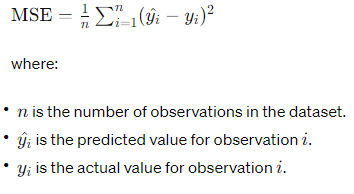

# aws_ml_capstone
## Project Overview

Efforts to anticipate stock market trends and predict future stock prices have long been a focal point for market researchers, investors, and scholars. The time, effort and resources behind this push are the enormous financial implications tied to accurate forecasting in the stock market. A dearth different approaches and models have been proposed, drawing from various methodologies and analytical techniques.
Fundamental Analysis stands as one of the foundational tactics in stock price prediction, employing a thorough examination of a company's financial health, including metrics such as sales, earnings, profits, and other economic factors. This approach aims to uncover intrinsic value and assess potential future performance based on fundamental indicators.
In contrast, Technical Analysis focuses on market psychology and price patterns, utilizing tools like Moving Averages and other stock indicators to forecast future price movements based on historical price data and trading volumes. This approach often seeks to exploit patterns and trends within the market itself.
Furthermore, Time Series Forecasting techniques play a significant role in stock price prediction, leveraging mathematical models such as Autoregressive Integrated Moving Average (ARIMA) and non-linear models like Artificial Neural Networks (ANN) and Deep Learning algorithms. These methods delve into historical price data to discern patterns and relationships that can inform future price predictions.
Given the complexities and uncertainties inherent in financial markets, the development of accurate and reliable stock price prediction models is paramount for informed decision-making in investment strategies. Consequently, this research endeavors to contribute to this ongoing discourse by presenting a comprehensive methodology for constructing and evaluating such models, with the ultimate goal of identifying the most effective approach for forecasting stock prices.
This work will be utilize multiple regression forecasting techniques as multiple regression is singular in focus, aiming to uncover the relationship between several predictors and a single outcome, while multivariate regression widens the scope by simultaneously exploring the relationships among multiple predictors and multiple outcomes. The former is commonly employed in scenarios where understanding the influence of various factors on a specific outcome is paramount, such as in economics, social sciences, or marketing research. Conversely, the latter finds utility in situations where the analysis demands an exploration of interconnectedness across multiple dependent variables, offering insights into complex systems or phenomena. 
 ### Related Research:
An ensemble of LSTM neural networks for high-frequency stock market classification: https://onlinelibrary.wiley.com/doi/10.1002/for.2585
Are Random Trading Strategies More Successful than Technical Ones? https://journals.plos.org/plosone/article?id=10.1371/journal.pone.0068344

## Problem Statement
Investors commonly make decisions regarding stock transactions by assessing a company's performance alongside the backdrop of unforeseen global, national, and social occurrences. While these events often trigger immediate fluctuations in stock prices, these effects tend to be short lived rather than enduring. Relying solely on Fundamental Analysis for stock price prediction becomes impractical and ultimately a losing strategy. Required is automated system or model that is capable of analyzing the stock market and forecasting future trends based on historical price data and technical indicators. This model would potentially offer investors a more reliable framework for navigating the complexities of the stock market, reducing the challenges posed by short-term fluctuations and facilitating more informed decision-making processes without evoking basic human emotion or reactions that come with everyday investing.

To approach this regression problem to predict stock's opening price I will develop a baseline regression model for stock price prediction. Once baseline performance is benchmarked I will compare the performance of the baseline model with Prophet, Amazon SageMaker's AutoGluon, and TensorFlow's LSTM model. Where possible I will perform hyperparameter tuning where necessary to optimize model performance. Lastly, once a champion model is determined I will deploy the best-performing model.

## Methodology

### Data 
I will be training the model on 9 years of Amazon stock price data spanning from January 1st 2015 to December 31st 2023 sourced from the yfinance API: https://pypi.org/project/yfinance/. The yfinance API is time series data sourced daily. In its original form the data is processed as the following:

Dropping both the ‘Dividends’ and ‘Stock Splits’ and resetting the ‘Date’ index to a column our data takes the shape of 2264 row and 6 columns with the following data types:
  Column  Non-Null Count  Dtype                           
---  ------  --------------  -----                           
 0   Date    2264 non-null   datetime64[ns, America/New_York]
 1   Open    2264 non-null   float64                         
 2   High    2264 non-null   float64                         
 3   Low     2264 non-null   float64                         
 4   Close   2264 non-null   float64                         
 5   Volume  2264 non-null   int64
 
The data will be split into a 70/30 split of training and testing data. Which will be appropriate as I will be forecasting the daily Open price for the AMNZ stock price. 

### Evaluation Metrics

MSE - MSE stands for Mean Squared Error, a widely used metric in statistics and machine learning for evaluating the accuracy of a predictive model. It quantifies the average squared difference between the predicted values and the actual values in a dataset. To compute MSE, you first calculate the squared difference between each predicted value yhat and its corresponding actual y value. Then, you take the average of these squared differences. The formula for MSE can be expressed as:

A lower MSE indicates better model performance, as it signifies that the model's predictions are closer to the actual values on average.

Related Research: 
https://www.researchgate.net/publication/374192136_Assessing_Machine_Learning's_Accuracy_in_Stock_Price_Prediction
https://www.mdpi.com/2079-9292/10/21/2717

### Baseline Regression Model:
I utilized sklearn's LinearRegression model and trained the model on 70% of the data. When comparing it to the test test I came to a baseline model performance MSE of 0.970390232979187.

### Amazon SageMaker's AutoGluon:
Amazon SageMaker Autogluon is an automated machine learning (AutoML) tool provided by Amazon Web Services (AWS) that is built on top of the Autogluon library. Autogluon is an open-source AutoML framework developed by the Apache MXNet community. SageMaker Autogluon simplifies the process of training and deploying machine learning models by automating many of the steps involved, such as feature engineering, model selection, hyperparameter tuning, and model evaluation.

Using Autogloun's TabularPredictor the predicted value is set to 'Open', problem type 'regression' and evaluation metric to 'mean squared error'. The winning model was WeightedEnsemble_L5 with a MSE of 81.44673385599222 when testing against the test set.

Hyperparameter tuning the AugoGluon model's learing rate, dropout probablility which used in neural network architectures to prevent overfitting in neural networks and activation function introduces non-linearity into the neural network, allowing it to learn complex relationships between features and target variables. The winning model was again WeightedEnsemble_L5 with a MSE of 88.07604118054836 when testing against the test set.

### Prophet Model:
Facebook Prophet is primarily designed for time series forecasting, focusing on predicting future values of a single time series variable. However, if you have a multiple regression problem where you want to forecast a dependent variable using both time series data and additional independent variables, you can still leverage Prophet by incorporating the additional predictors as regressors. 

Instantiate Prophet Model: Instantiate a Prophet model in Python using the Prophet class from the prophet package. You can then use the add_regressor() method to add each of your independent variables to the model. Make sure to set seasonality_mode='additive' if you're including additional regressors.

Fit the Model: Fit the Prophet model to your dataset using the fit() method, passing in your prepared dataframe.

Forecasting: Then, use the predict() method to forecast future values, passing in the future dataframe.

The MSE for the Prophet model was 2.1994794315927653.

### TensorFlow's LSTM Model:
Using TensorFlow's LSTM (Long Short-Term Memory). First hyperparameter tuning is conducted using Sagemaker's script mode. The hyperparamters tunded are batch size, epochs and the optimizer type. The scrip hpo.py utilizes the 'Sequential' class from Keras.Setting return_sequences=True means that the layer will return the full sequence of outputs for each input sequence rather than just the last output. input_shape=(n_steps, n_features) specifies the shape of the input data expected by the model, where n_steps is the number of time steps in each input sequence, and n_features is the number of features (variables) in each time step. The first LSTM layer has 264 units and returns sequences, with an input shape of (30, 5), meaning each input sequence has 30 time steps and 5 features. The second and third LSTM layers have 128 and 64 units, respectively. All LSTM layers have dropout regularization with a rate of 0.2 applied after them. A Flatten layer is added to convert the 3D output of the LSTM layers into a 2D tensor. Two fully connected Dense layers are added with 32 and 1 units, respectively, for the output. Dropout regularization with a rate of 0.2 is applied after the first dense layer.
Since this is a regression problem (predicting a continuous variable), no activation function is specified for this layer, meaning it defaults to a linear activation function (identity function).

The best hyperparameters are then reincorporated into a Tensorflow estimator the retrained. The model is then deployed and tested against the test set with a performance MSE metric of 0.0016983404690519472.

## Justification
MSE Basline Linear Regression Model: 1.0916151765857767e-09
MSE of Autoglon Model: 81.44673385599222
MSE of HPO Autoglon Model: 88.07604118054836
MSE of Prophet Model: 2.1994794315927653
MSE of HPO LSTM Model: 0.0016983404690519472

The MSE of HOP LSTM Model clearly out preforms all other models based on the set evalation metric.
